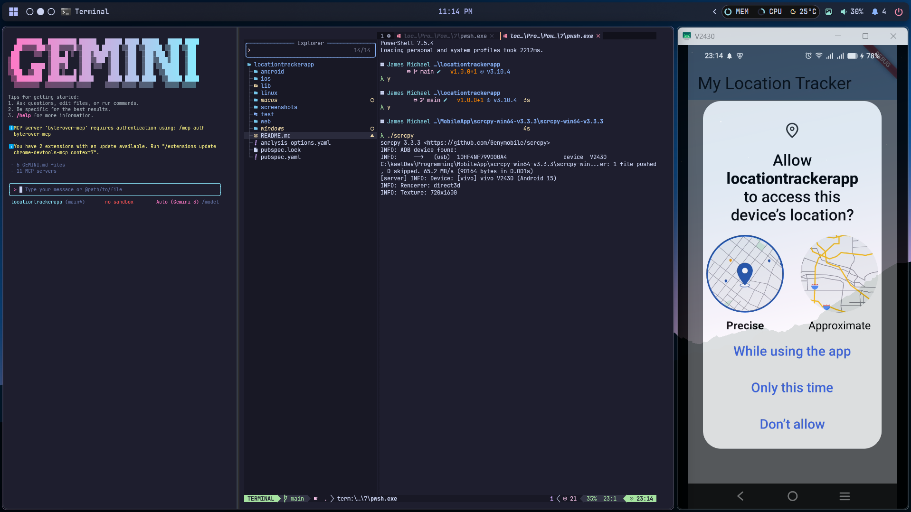
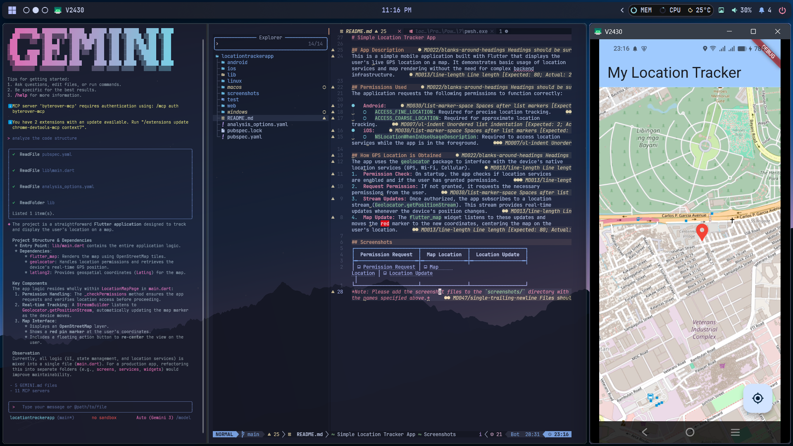
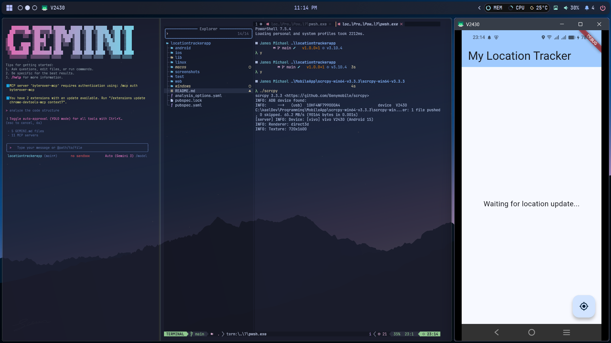

# Simple Location Tracker App

## App Description
This is a simple mobile application built with Flutter that displays the user's live GPS location on a map. It demonstrates basic usage of location services and map rendering without the need for complex backend infrastructure.

## Permissions Used
The application requests the following permissions to function correctly:

*   **Android:**
    *   `ACCESS_FINE_LOCATION`: Required for precise location tracking.
    *   `ACCESS_COARSE_LOCATION`: Required for approximate location tracking.
*   **iOS:**
    *   `NSLocationWhenInUseUsageDescription`: Required to access location services while the app is in the foreground.

## How GPS Location is Obtained
The app uses the `geolocator` package to interface with the device's native location services (GPS, Wi-Fi, Cellular).
1.  **Permission Check:** On startup, the app checks if location services are enabled and if the user has granted permission.
2.  **Request Permission:** If not granted, it requests the necessary permissions from the user.
3.  **Stream Updates:** Once authorized, the app subscribes to a location stream (`Geolocator.getPositionStream`). This stream provides real-time updates whenever the device's position changes.
4.  **Map Update:** The `flutter_map` widget listens to these updates and moves the red marker to the new coordinates, centering the map on the user's location.

## Screenshots

| Permission Request | Map Location | Location Update |
| :---: | :---: | :---: |
|  |  |  |

*Note: Please add the screenshot files to the `screenshots/` directory with the names specified above.*